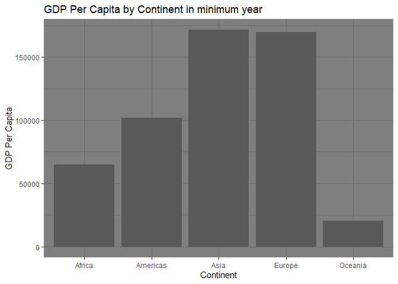

Gapminder
================
(Your name here)
2020-

- [Grading Rubric](#grading-rubric)
  - [Individual](#individual)
  - [Submission](#submission)
- [Guided EDA](#guided-eda)
  - [**q0** Perform your “first checks” on the dataset. What variables
    are in
    this](#q0-perform-your-first-checks-on-the-dataset-what-variables-are-in-this)
  - [**q1** Determine the most and least recent years in the `gapminder`
    dataset.](#q1-determine-the-most-and-least-recent-years-in-the-gapminder-dataset)
  - [**q2** Filter on years matching `year_min`, and make a plot of the
    GDP per capita against continent. Choose an appropriate `geom_` to
    visualize the data. What observations can you
    make?](#q2-filter-on-years-matching-year_min-and-make-a-plot-of-the-gdp-per-capita-against-continent-choose-an-appropriate-geom_-to-visualize-the-data-what-observations-can-you-make)
  - [**q3** You should have found *at least* three outliers in q2 (but
    possibly many more!). Identify those outliers (figure out which
    countries they
    are).](#q3-you-should-have-found-at-least-three-outliers-in-q2-but-possibly-many-more-identify-those-outliers-figure-out-which-countries-they-are)
  - [**q4** Create a plot similar to yours from q2 studying both
    `year_min` and `year_max`. Find a way to highlight the outliers from
    q3 on your plot *in a way that lets you identify which country is
    which*. Compare the patterns between `year_min` and
    `year_max`.](#q4-create-a-plot-similar-to-yours-from-q2-studying-both-year_min-and-year_max-find-a-way-to-highlight-the-outliers-from-q3-on-your-plot-in-a-way-that-lets-you-identify-which-country-is-which-compare-the-patterns-between-year_min-and-year_max)
- [Your Own EDA](#your-own-eda)
  - [**q5** Create *at least* three new figures below. With each figure,
    try to pose new questions about the
    data.](#q5-create-at-least-three-new-figures-below-with-each-figure-try-to-pose-new-questions-about-the-data)

*Purpose*: Learning to do EDA well takes practice! In this challenge
you’ll further practice EDA by first completing a guided exploration,
then by conducting your own investigation. This challenge will also give
you a chance to use the wide variety of visual tools we’ve been
learning.

<!-- include-rubric -->

# Grading Rubric

<!-- -------------------------------------------------- -->

Unlike exercises, **challenges will be graded**. The following rubrics
define how you will be graded, both on an individual and team basis.

## Individual

<!-- ------------------------- -->

| Category | Needs Improvement | Satisfactory |
|----|----|----|
| Effort | Some task **q**’s left unattempted | All task **q**’s attempted |
| Observed | Did not document observations, or observations incorrect | Documented correct observations based on analysis |
| Supported | Some observations not clearly supported by analysis | All observations clearly supported by analysis (table, graph, etc.) |
| Assessed | Observations include claims not supported by the data, or reflect a level of certainty not warranted by the data | Observations are appropriately qualified by the quality & relevance of the data and (in)conclusiveness of the support |
| Specified | Uses the phrase “more data are necessary” without clarification | Any statement that “more data are necessary” specifies which *specific* data are needed to answer what *specific* question |
| Code Styled | Violations of the [style guide](https://style.tidyverse.org/) hinder readability | Code sufficiently close to the [style guide](https://style.tidyverse.org/) |

## Submission

<!-- ------------------------- -->

Make sure to commit both the challenge report (`report.md` file) and
supporting files (`report_files/` folder) when you are done! Then submit
a link to Canvas. **Your Challenge submission is not complete without
all files uploaded to GitHub.**

``` r
library(tidyverse)
```

    ## ── Attaching core tidyverse packages ──────────────────────── tidyverse 2.0.0 ──
    ## ✔ dplyr     1.1.4     ✔ readr     2.1.5
    ## ✔ forcats   1.0.0     ✔ stringr   1.5.1
    ## ✔ ggplot2   3.5.1     ✔ tibble    3.2.1
    ## ✔ lubridate 1.9.4     ✔ tidyr     1.3.1
    ## ✔ purrr     1.0.2     
    ## ── Conflicts ────────────────────────────────────────── tidyverse_conflicts() ──
    ## ✖ dplyr::filter() masks stats::filter()
    ## ✖ dplyr::lag()    masks stats::lag()
    ## ℹ Use the conflicted package (<http://conflicted.r-lib.org/>) to force all conflicts to become errors

``` r
library(gapminder)
```

*Background*: [Gapminder](https://www.gapminder.org/about-gapminder/) is
an independent organization that seeks to educate people about the state
of the world. They seek to counteract the worldview constructed by a
hype-driven media cycle, and promote a “fact-based worldview” by
focusing on data. The dataset we’ll study in this challenge is from
Gapminder.

# Guided EDA

<!-- -------------------------------------------------- -->

First, we’ll go through a round of *guided EDA*. Try to pay attention to
the high-level process we’re going through—after this guided round
you’ll be responsible for doing another cycle of EDA on your own!

### **q0** Perform your “first checks” on the dataset. What variables are in this

dataset?

``` r
gapminder
```

    ## # A tibble: 1,704 × 6
    ##    country     continent  year lifeExp      pop gdpPercap
    ##    <fct>       <fct>     <int>   <dbl>    <int>     <dbl>
    ##  1 Afghanistan Asia       1952    28.8  8425333      779.
    ##  2 Afghanistan Asia       1957    30.3  9240934      821.
    ##  3 Afghanistan Asia       1962    32.0 10267083      853.
    ##  4 Afghanistan Asia       1967    34.0 11537966      836.
    ##  5 Afghanistan Asia       1972    36.1 13079460      740.
    ##  6 Afghanistan Asia       1977    38.4 14880372      786.
    ##  7 Afghanistan Asia       1982    39.9 12881816      978.
    ##  8 Afghanistan Asia       1987    40.8 13867957      852.
    ##  9 Afghanistan Asia       1992    41.7 16317921      649.
    ## 10 Afghanistan Asia       1997    41.8 22227415      635.
    ## # ℹ 1,694 more rows

**Observations**:

- Variables: Country, Continent, Year, Life expectancy, population, GDP
  Per Capita.
- Data set seems pretty tidy to me. I dont think I need to clean it up.

### **q1** Determine the most and least recent years in the `gapminder` dataset.

*Hint*: Use the `pull()` function to get a vector out of a tibble.
(Rather than the `$` notation of base R.)

``` r
## TASK: Find the largest and smallest values of `year` in `gapminder`
library(dplyr)
gapminder
```

    ## # A tibble: 1,704 × 6
    ##    country     continent  year lifeExp      pop gdpPercap
    ##    <fct>       <fct>     <int>   <dbl>    <int>     <dbl>
    ##  1 Afghanistan Asia       1952    28.8  8425333      779.
    ##  2 Afghanistan Asia       1957    30.3  9240934      821.
    ##  3 Afghanistan Asia       1962    32.0 10267083      853.
    ##  4 Afghanistan Asia       1967    34.0 11537966      836.
    ##  5 Afghanistan Asia       1972    36.1 13079460      740.
    ##  6 Afghanistan Asia       1977    38.4 14880372      786.
    ##  7 Afghanistan Asia       1982    39.9 12881816      978.
    ##  8 Afghanistan Asia       1987    40.8 13867957      852.
    ##  9 Afghanistan Asia       1992    41.7 16317921      649.
    ## 10 Afghanistan Asia       1997    41.8 22227415      635.
    ## # ℹ 1,694 more rows

``` r
year_max <-
  gapminder %>%
  pull(year) %>%
  max()

year_min <-
  gapminder %>%
  pull(year) %>%
  min()
```

Use the following test to check your work.

``` r
## NOTE: No need to change this
assertthat::assert_that(year_max %% 7 == 5)
```

    ## [1] TRUE

``` r
assertthat::assert_that(year_max %% 3 == 0)
```

    ## [1] TRUE

``` r
assertthat::assert_that(year_min %% 7 == 6)
```

    ## [1] TRUE

``` r
assertthat::assert_that(year_min %% 3 == 2)
```

    ## [1] TRUE

``` r
if (is_tibble(year_max)) {
  print("year_max is a tibble; try using `pull()` to get a vector")
  assertthat::assert_that(False)
}

print("Nice!")
```

    ## [1] "Nice!"

### **q2** Filter on years matching `year_min`, and make a plot of the GDP per capita against continent. Choose an appropriate `geom_` to visualize the data. What observations can you make?

You may encounter difficulties in visualizing these data; if so document
your challenges and attempt to produce the most informative visual you
can.

``` r
library(ggplot2)
df_filtered <- gapminder[gapminder$year == year_min, ]
df_summarized <- df_filtered %>%
  group_by(continent) %>%
  summarise(gdpPercap = sum(gdpPercap, na.rm = TRUE))


ggplot(df_filtered, aes(x = continent, y = gdpPercap)) +
  geom_point() +
  ggtitle("GDP Per Capita by Continent in minimum year") +
  xlab("Continent") +
  ylab("GDP Per Capita") +
  theme_dark()
```

<!-- -->

``` r
ggplot(df_filtered, aes(x = country, y = gdpPercap, label = abbreviate(country, minlength = 3))) +
  geom_point() +
  geom_text(vjust = -0.5, size = 2) +
  theme(
    axis.text.x = element_blank(),
    axis.ticks.x = element_blank()
  ) +
  ggtitle("GDP Per Capita by Continent in minimum year") +
  facet_wrap(~continent) +
  xlab("Country") +
  ylab("GDP Per Capita") +
  theme_dark()
```

<!-- -->

``` r
no_more_kuwait_max <- df_filtered[!(df_filtered$country == "Kuwait"), ]

ggplot(no_more_kuwait_max, aes(x = country, y = gdpPercap, label = abbreviate(country, minlength = 3))) +
  geom_point() +
  geom_text(vjust = -0.5, size = 2) +
  theme(
    axis.text.x = element_blank(),
    axis.ticks.x = element_blank()
  ) +
  ggtitle("GDP Per Capita by Continent in minimum year") +
  facet_wrap(~continent) +
  xlab("Country") +
  ylab("GDP Per Capita") +
  theme_dark()
```

<!-- -->

**Observations**:

- I can see that Asia and Europe have similar GDPs. Oceania has the
  smallest GDP by a wide margin. Americas are much lower then I would
  have thought.
- Kuwait has a dissproportionatly high GDP percap.

**Difficulties & Approaches**:

- First pass at trying to just scatterplot GDP across continent didn’t
  work because it did not sum up the gdps per continent just plotted
  each point.

- I also faceted a scatter plot by country continent and gdp.

- Kuwait was so much of an outlier that it squashed the rest of the data
  into obscurity so I deleted it and redid the facet graphs to find
  outliers.

### **q3** You should have found *at least* three outliers in q2 (but possibly many more!). Identify those outliers (figure out which countries they are).

``` r
## TASK: Identify the outliers from q2
```

**Observations**:

- Identify the outlier countries from q2
  - Kuwait was disproportionately high in gdp percapita to the point
    where it made most of the data unreadable at the original graph
    scaling. I had to remove it and plot again to find that both the US
    and Canada have much higher GDP per capita then the rest of north
    america.

*Hint*: For the next task, it’s helpful to know a ggplot trick we’ll
learn in an upcoming exercise: You can use the `data` argument inside
any `geom_*` to modify the data that will be plotted *by that geom
only*. For instance, you can use this trick to filter a set of points to
label:

``` r
## NOTE: No need to edit, use ideas from this in q4 below
gapminder %>%
  filter(year == max(year)) %>%
  ggplot(aes(continent, lifeExp)) +
  geom_boxplot() +
  geom_point(
    data = . %>% filter(country %in% c("United Kingdom", "Japan", "Zambia")),
    mapping = aes(color = country),
    size = 2
  )
```

<!-- -->

### **q4** Create a plot similar to yours from q2 studying both `year_min` and `year_max`. Find a way to highlight the outliers from q3 on your plot *in a way that lets you identify which country is which*. Compare the patterns between `year_min` and `year_max`.

*Hint*: We’ve learned a lot of different ways to show multiple
variables; think about using different aesthetics or facets.

``` r
## TASK: Create a visual of gdpPercap vs continent
library(ggplot2)
df_filtered <- gapminder[gapminder$year == year_min, ]
df_summarized_min <- df_filtered %>%
  group_by(continent) %>%
  summarise(gdpPercap = sum(gdpPercap, na.rm = TRUE))


ggplot(df_filtered, aes(x = continent, y = gdpPercap)) +
  geom_point() +
  ggtitle("GDP Per Capita by Continent in minimum year") +
  xlab("Continent") +
  ylab("GDP Per Capita") +
  theme_dark()
```

<!-- -->

``` r
ggplot(df_filtered, aes(x = country, y = gdpPercap, label = abbreviate(country, minlength = 3))) +
  geom_point() +
  geom_text(vjust = -0.5, size = 2) +
  theme(
    axis.text.x = element_blank(),
    axis.ticks.x = element_blank()
  ) +
  ggtitle("GDP Per Capita by Continent in minimum year") +
  facet_wrap(~continent) +
  xlab("Country") +
  ylab("GDP Per Capita") +
  theme_dark()
```

<!-- -->

``` r
no_more_kuwait_min <- df_filtered[!(df_filtered$country == "Kuwait"), ]

ggplot(no_more_kuwait_min, aes(x = country, y = gdpPercap, label = abbreviate(country, minlength = 3))) +
  geom_point() +
  geom_text(vjust = -0.5, size = 2) +
  theme(
    axis.text.x = element_blank(),
    axis.ticks.x = element_blank()
  ) +
  ggtitle("GDP Per Capita by Continent in minimum year") +
  facet_wrap(~continent) +
  xlab("Country") +
  ylab("GDP Per Capita") +
  theme_dark()
```

<!-- -->

``` r
df_filtered <- gapminder[gapminder$year == year_max, ]
df_summarized_max <- df_filtered %>%
  group_by(continent) %>%
  summarise(gdpPercap = sum(gdpPercap, na.rm = TRUE))


ggplot(df_filtered, aes(x = continent, y = gdpPercap)) +
  geom_point() +
  ggtitle("GDP Per Capita by Continent in maximum year") +
  xlab("Continent") +
  ylab("GDP Per Capita") +
  theme_dark()
```

<!-- -->

``` r
ggplot(df_filtered, aes(x = country, y = gdpPercap, label = abbreviate(country, minlength = 3))) +
  geom_point() +
  geom_text(vjust = -0.5, size = 2) +
  theme(
    axis.text.x = element_blank(),
    axis.ticks.x = element_blank()
  ) +
  ggtitle("GDP Per Capita by Continent in maximum year") +
  facet_wrap(~continent) +
  xlab("Country") +
  ylab("GDP Per Capita") +
  theme_dark()
```

<!-- -->

``` r
no_more_kuwait_max <- df_filtered[!(df_filtered$country == "Kuwait"), ]

ggplot(no_more_kuwait_max, aes(x = country, y = gdpPercap, label = abbreviate(country, minlength = 3))) +
  geom_point() +
  geom_text(vjust = -0.5, size = 2) +
  theme(
    axis.text.x = element_blank(),
    axis.ticks.x = element_blank()
  ) +
  ggtitle("GDP Per Capita by Continent in maximum year") +
  facet_wrap(~continent) +
  xlab("Country") +
  ylab("GDP Per Capita") +
  theme_dark()
```

<!-- -->

**Observations**:

- Kuwait no longer is so disproportionally high and some of its asian
  peers almost match it
- Proportionally the canadians and americans maintain their lead over
  the rest of the americas.

# Your Own EDA

<!-- -------------------------------------------------- -->

Now it’s your turn! We just went through guided EDA considering the GDP
per capita at two time points. You can continue looking at outliers,
consider different years, repeat the exercise with `lifeExp`, consider
the relationship between variables, or something else entirely.

### **q5** Create *at least* three new figures below. With each figure, try to pose new questions about the data.

``` r
## TASK: Your first graph
ggplot(df_summarized_min, aes(x = continent, y = gdpPercap)) +
  geom_bar(stat = "identity", position = "dodge") +
  ggtitle("GDP Per Capita by Continent in minimum year") +
  xlab("Continent") +
  ylab("GDP Per Capita") +
  theme_dark()
```

<!-- -->

- Ocieania is lower then its peers likely due to its proportionally
  smaller population.
- Africa is disproportionately lower despite its fairly large population
  due to its underdevelopent.

``` r
ggplot(df_summarized_max, aes(x = continent, y = gdpPercap)) +
  geom_bar(stat = "identity", position = "dodge") +
  ggtitle("GDP Per Capita by Continent in max year") +
  xlab("Continent") +
  ylab("GDP Per Capita") +
  theme_dark()
```

<!-- -->

- The Magnitude of the numbers involved across the board increased due
  to inflation and the population of the world increasing.
- Europe likely gleaned massive benefits from the EU allowing it to pull
  ahead in GDP per capita.

``` r
ggplot(no_more_kuwait_min, aes(x = continent, y = gdpPercap)) +
  geom_bar(stat = "identity", position = "dodge") +
  ggtitle("GDP Per Capita by Continent in min year without kuwait") +
  xlab("Continent") +
  ylab("GDP Per Capita") +
  theme_dark()
```

<!-- -->

- The removal of kuwait apparently breaks the econmy of the world and
  skews every single GDP sum even in continents unrelated to it. Clearly
  kuwait is a lynchpin of the global econmy and removal of it causes
  total economic collapse.
