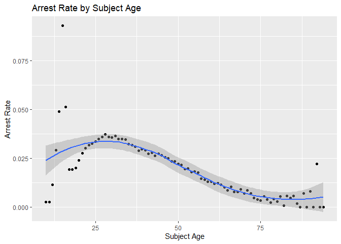
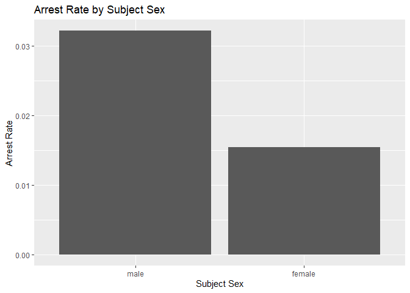
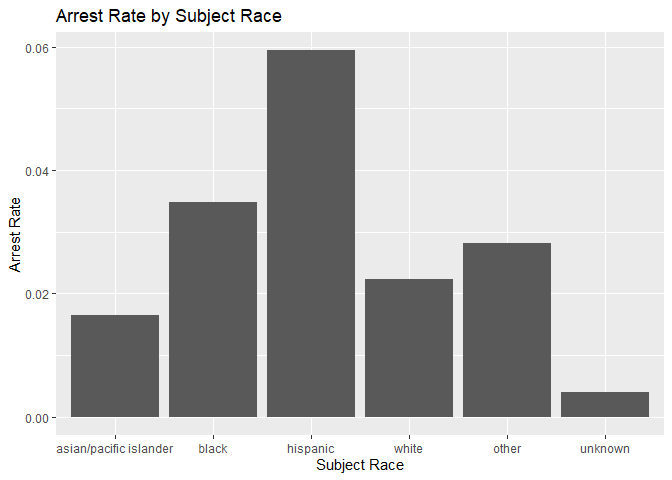
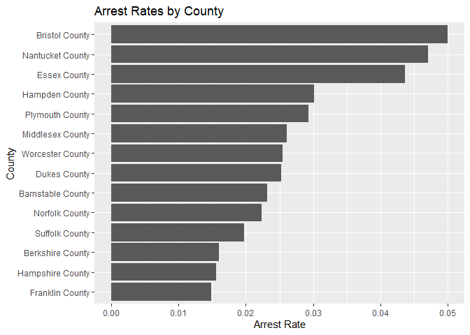

Massachusetts Highway Stops
================
(Your name here)
2020-

- [Grading Rubric](#grading-rubric)
  - [Individual](#individual)
  - [Submission](#submission)
- [Setup](#setup)
  - [**q1** Go to the Stanford Open Policing Project page and download
    the Massachusetts State Police records in `Rds` format. Move the
    data to your `data` folder and match the `filename` to load the
    data.](#q1-go-to-the-stanford-open-policing-project-page-and-download-the-massachusetts-state-police-records-in-rds-format-move-the-data-to-your-data-folder-and-match-the-filename-to-load-the-data)
- [EDA](#eda)
  - [**q2** Do your “first checks” on the dataset. What are the basic
    facts about this
    dataset?](#q2-do-your-first-checks-on-the-dataset-what-are-the-basic-facts-about-this-dataset)
  - [**q3** Check the set of factor levels for `subject_race` and
    `raw_Race`. What do you note about overlap / difference between the
    two
    sets?](#q3-check-the-set-of-factor-levels-for-subject_race-and-raw_race-what-do-you-note-about-overlap--difference-between-the-two-sets)
  - [**q5** Compare the *arrest rate*—the fraction of total cases in
    which the subject was arrested—across different factors. Create as
    many visuals (or tables) as you need, but make sure to check the
    trends across all of the `subject` variables. Answer the questions
    under *observations*
    below.](#q5-compare-the-arrest-ratethe-fraction-of-total-cases-in-which-the-subject-was-arrestedacross-different-factors-create-as-many-visuals-or-tables-as-you-need-but-make-sure-to-check-the-trends-across-all-of-the-subject-variables-answer-the-questions-under-observations-below)
- [Modeling](#modeling)
  - [**q6** Run the following code and interpret the regression
    coefficients. Answer the the questions under *observations*
    below.](#q6-run-the-following-code-and-interpret-the-regression-coefficients-answer-the-the-questions-under-observations-below)
  - [**q7** Re-fit the logistic regression from q6 setting `"white"` as
    the reference level for `subject_race`. Interpret the the model
    terms and answer the questions
    below.](#q7-re-fit-the-logistic-regression-from-q6-setting-white-as-the-reference-level-for-subject_race-interpret-the-the-model-terms-and-answer-the-questions-below)
  - [**q8** Re-fit the model using a factor indicating the presence of
    contraband in the subject’s vehicle. Answer the questions under
    *observations*
    below.](#q8-re-fit-the-model-using-a-factor-indicating-the-presence-of-contraband-in-the-subjects-vehicle-answer-the-questions-under-observations-below)
  - [Further Reading](#further-reading)

*Purpose*: In this last challenge we’ll focus on using logistic
regression to study a large, complicated dataset. Interpreting the
results of a model can be challenging—both in terms of the statistics
and the real-world reasoning—so we’ll get some practice in this
challenge.

<!-- include-rubric -->

# Grading Rubric

<!-- -------------------------------------------------- -->

Unlike exercises, **challenges will be graded**. The following rubrics
define how you will be graded, both on an individual and team basis.

## Individual

<!-- ------------------------- -->

| Category | Needs Improvement | Satisfactory |
|----|----|----|
| Effort | Some task **q**’s left unattempted | All task **q**’s attempted |
| Observed | Did not document observations, or observations incorrect | Documented correct observations based on analysis |
| Supported | Some observations not clearly supported by analysis | All observations clearly supported by analysis (table, graph, etc.) |
| Assessed | Observations include claims not supported by the data, or reflect a level of certainty not warranted by the data | Observations are appropriately qualified by the quality & relevance of the data and (in)conclusiveness of the support |
| Specified | Uses the phrase “more data are necessary” without clarification | Any statement that “more data are necessary” specifies which *specific* data are needed to answer what *specific* question |
| Code Styled | Violations of the [style guide](https://style.tidyverse.org/) hinder readability | Code sufficiently close to the [style guide](https://style.tidyverse.org/) |

## Submission

<!-- ------------------------- -->

Make sure to commit both the challenge report (`report.md` file) and
supporting files (`report_files/` folder) when you are done! Then submit
a link to Canvas. **Your Challenge submission is not complete without
all files uploaded to GitHub.**

*Background*: We’ll study data from the [Stanford Open Policing
Project](https://openpolicing.stanford.edu/data/), specifically their
dataset on Massachusetts State Patrol police stops.

``` r
library(tidyverse)
```

    ## ── Attaching core tidyverse packages ──────────────────────── tidyverse 2.0.0 ──
    ## ✔ dplyr     1.1.4     ✔ readr     2.1.5
    ## ✔ forcats   1.0.0     ✔ stringr   1.5.1
    ## ✔ ggplot2   3.5.1     ✔ tibble    3.2.1
    ## ✔ lubridate 1.9.4     ✔ tidyr     1.3.1
    ## ✔ purrr     1.0.2     
    ## ── Conflicts ────────────────────────────────────────── tidyverse_conflicts() ──
    ## ✖ dplyr::filter() masks stats::filter()
    ## ✖ dplyr::lag()    masks stats::lag()
    ## ℹ Use the conflicted package (<http://conflicted.r-lib.org/>) to force all conflicts to become errors

``` r
library(broom)
```

# Setup

<!-- -------------------------------------------------- -->

### **q1** Go to the [Stanford Open Policing Project](https://openpolicing.stanford.edu/data/) page and download the Massachusetts State Police records in `Rds` format. Move the data to your `data` folder and match the `filename` to load the data.

*Note*: An `Rds` file is an R-specific file format. The function
`readRDS` will read these files.

``` r
## TODO: Download the data, move to your data folder, and load it
filename <- "yg821jf8611_ma_statewide_2020_04_01.rds"
df_data <- readRDS(filename)
```

# EDA

<!-- -------------------------------------------------- -->

### **q2** Do your “first checks” on the dataset. What are the basic facts about this dataset?

**Observations**:

``` r
glimpse(df_data)
```

    ## Rows: 3,416,238
    ## Columns: 24
    ## $ raw_row_number             <chr> "1", "2", "3", "4", "5", "6", "7", "8", "9"…
    ## $ date                       <date> 2007-06-06, 2007-06-07, 2007-06-07, 2007-0…
    ## $ location                   <chr> "MIDDLEBOROUGH", "SEEKONK", "MEDFORD", "MED…
    ## $ county_name                <chr> "Plymouth County", "Bristol County", "Middl…
    ## $ subject_age                <int> 33, 36, 56, 37, 22, 34, 54, 31, 21, 56, 56,…
    ## $ subject_race               <fct> white, white, white, white, hispanic, white…
    ## $ subject_sex                <fct> male, male, female, male, female, male, mal…
    ## $ type                       <fct> vehicular, vehicular, vehicular, vehicular,…
    ## $ arrest_made                <lgl> FALSE, FALSE, FALSE, FALSE, FALSE, FALSE, F…
    ## $ citation_issued            <lgl> TRUE, FALSE, FALSE, FALSE, TRUE, TRUE, TRUE…
    ## $ warning_issued             <lgl> FALSE, TRUE, TRUE, TRUE, FALSE, FALSE, FALS…
    ## $ outcome                    <fct> citation, warning, warning, warning, citati…
    ## $ contraband_found           <lgl> NA, FALSE, NA, NA, NA, NA, NA, NA, NA, NA, …
    ## $ contraband_drugs           <lgl> NA, FALSE, NA, NA, NA, NA, NA, NA, NA, NA, …
    ## $ contraband_weapons         <lgl> NA, FALSE, NA, NA, NA, NA, NA, NA, NA, NA, …
    ## $ contraband_alcohol         <lgl> FALSE, FALSE, FALSE, FALSE, FALSE, FALSE, F…
    ## $ contraband_other           <lgl> NA, FALSE, NA, NA, NA, NA, NA, NA, NA, NA, …
    ## $ frisk_performed            <lgl> NA, FALSE, NA, NA, NA, NA, NA, NA, NA, NA, …
    ## $ search_conducted           <lgl> FALSE, TRUE, FALSE, FALSE, FALSE, FALSE, FA…
    ## $ search_basis               <fct> NA, other, NA, NA, NA, NA, NA, NA, NA, NA, …
    ## $ reason_for_stop            <chr> "Speed", NA, NA, NA, NA, "Speed", NA, NA, N…
    ## $ vehicle_type               <chr> "Passenger", "Commercial", "Passenger", "Co…
    ## $ vehicle_registration_state <fct> MA, MA, MA, MA, MA, MA, MA, MA, MA, MA, MA,…
    ## $ raw_Race                   <chr> "White", "White", "White", "White", "Hispan…

``` r
summary(df_data)
```

    ##  raw_row_number          date              location         county_name       
    ##  Length:3416238     Min.   :2007-01-01   Length:3416238     Length:3416238    
    ##  Class :character   1st Qu.:2009-04-22   Class :character   Class :character  
    ##  Mode  :character   Median :2011-07-08   Mode  :character   Mode  :character  
    ##                     Mean   :2011-07-16                                        
    ##                     3rd Qu.:2013-08-27                                        
    ##                     Max.   :2015-12-31                                        
    ##                                                                               
    ##   subject_age                     subject_race     subject_sex     
    ##  Min.   :10.00    asian/pacific islander: 166842   male  :2362238  
    ##  1st Qu.:25.00    black                 : 351610   female:1038377  
    ##  Median :34.00    hispanic              : 338317   NA's  :  15623  
    ##  Mean   :36.47    white                 :2529780                   
    ##  3rd Qu.:46.00    other                 :  11008                   
    ##  Max.   :94.00    unknown               :  17017                   
    ##  NA's   :158006   NA's                  :   1664                   
    ##          type         arrest_made     citation_issued warning_issued 
    ##  pedestrian:      0   Mode :logical   Mode :logical   Mode :logical  
    ##  vehicular :3416238   FALSE:3323303   FALSE:1244039   FALSE:2269244  
    ##                       TRUE :92019     TRUE :2171283   TRUE :1146078  
    ##                       NA's :916       NA's :916       NA's :916      
    ##                                                                      
    ##                                                                      
    ##                                                                      
    ##      outcome        contraband_found contraband_drugs contraband_weapons
    ##  warning :1146078   Mode :logical    Mode :logical    Mode :logical     
    ##  citation:2171283   FALSE:28256      FALSE:36296      FALSE:53237       
    ##  summons :      0   TRUE :27474      TRUE :19434      TRUE :2493        
    ##  arrest  :  92019   NA's :3360508    NA's :3360508    NA's :3360508     
    ##  NA's    :   6858                                                       
    ##                                                                         
    ##                                                                         
    ##  contraband_alcohol contraband_other frisk_performed search_conducted
    ##  Mode :logical      Mode :logical    Mode :logical   Mode :logical   
    ##  FALSE:3400070      FALSE:51708      FALSE:51029     FALSE:3360508   
    ##  TRUE :16168        TRUE :4022       TRUE :3602      TRUE :55730     
    ##                     NA's :3360508    NA's :3361607                   
    ##                                                                      
    ##                                                                      
    ##                                                                      
    ##          search_basis     reason_for_stop    vehicle_type      
    ##  k9            :      0   Length:3416238     Length:3416238    
    ##  plain view    :      0   Class :character   Class :character  
    ##  consent       :   6903   Mode  :character   Mode  :character  
    ##  probable cause:  25898                                        
    ##  other         :  18228                                        
    ##  NA's          :3365209                                        
    ##                                                                
    ##  vehicle_registration_state   raw_Race        
    ##  MA     :3053713            Length:3416238    
    ##  CT     :  82906            Class :character  
    ##  NY     :  69059            Mode  :character  
    ##  NH     :  51514                              
    ##  RI     :  39375                              
    ##  (Other): 109857                              
    ##  NA's   :   9814

``` r
dim(df_data)
```

    ## [1] 3416238      24

``` r
names(df_data)
```

    ##  [1] "raw_row_number"             "date"                      
    ##  [3] "location"                   "county_name"               
    ##  [5] "subject_age"                "subject_race"              
    ##  [7] "subject_sex"                "type"                      
    ##  [9] "arrest_made"                "citation_issued"           
    ## [11] "warning_issued"             "outcome"                   
    ## [13] "contraband_found"           "contraband_drugs"          
    ## [15] "contraband_weapons"         "contraband_alcohol"        
    ## [17] "contraband_other"           "frisk_performed"           
    ## [19] "search_conducted"           "search_basis"              
    ## [21] "reason_for_stop"            "vehicle_type"              
    ## [23] "vehicle_registration_state" "raw_Race"

``` r
colSums(is.na(df_data))
```

    ##             raw_row_number                       date 
    ##                          0                          0 
    ##                   location                county_name 
    ##                       6666                       6666 
    ##                subject_age               subject_race 
    ##                     158006                       1664 
    ##                subject_sex                       type 
    ##                      15623                          0 
    ##                arrest_made            citation_issued 
    ##                        916                        916 
    ##             warning_issued                    outcome 
    ##                        916                       6858 
    ##           contraband_found           contraband_drugs 
    ##                    3360508                    3360508 
    ##         contraband_weapons         contraband_alcohol 
    ##                    3360508                          0 
    ##           contraband_other            frisk_performed 
    ##                    3360508                    3361607 
    ##           search_conducted               search_basis 
    ##                          0                    3365209 
    ##            reason_for_stop               vehicle_type 
    ##                    1659589                       4963 
    ## vehicle_registration_state                   raw_Race 
    ##                       9814                       1664

``` r
df_data %>%
  select_if(is.numeric) %>%
  summary()
```

    ##   subject_age    
    ##  Min.   :10.00   
    ##  1st Qu.:25.00   
    ##  Median :34.00   
    ##  Mean   :36.47   
    ##  3rd Qu.:46.00   
    ##  Max.   :94.00   
    ##  NA's   :158006

- What are the basic facts about this dataset?
- 24 data collumns
- spans from 2007 to 2015
- a lot of missing data too
- 
- …

Note that we have both a `subject_race` and `race_Raw` column. There are
a few possibilities as to what `race_Raw` represents:

- `race_Raw` could be the race of the police officer in the stop
- `race_Raw` could be an unprocessed version of `subject_race`

Let’s try to distinguish between these two possibilities.

### **q3** Check the set of factor levels for `subject_race` and `raw_Race`. What do you note about overlap / difference between the two sets?

``` r
## TODO: Determine the factor levels for subject_race and
levels(as.factor(df_data$subject_race))
```

    ## [1] "asian/pacific islander" "black"                  "hispanic"              
    ## [4] "white"                  "other"                  "unknown"

``` r
levels(as.factor(df_data$raw_Race))
```

    ## [1] "A"                                            
    ## [2] "American Indian or Alaskan Native"            
    ## [3] "Asian or Pacific Islander"                    
    ## [4] "Black"                                        
    ## [5] "Hispanic"                                     
    ## [6] "Middle Eastern or East Indian (South Asian)"  
    ## [7] "None - for no operator present citations only"
    ## [8] "White"

**Observations**:

- What are the unique values for `subject_race`? asian/pacific islander
  black hispanic white other unknown
- What are the unique values for `raw_Race`? A American Indian or
  Alaskan Native Asian or Pacific Islander Black Hispanic Middle
  Easetern or East Indian (South Asian) None - for no operator presnet
  citations only White
- What is the overlap between the two sets? Asian/Pacific Islander Black
  Hispanic White
- What is the difference between the two sets? raw race has a much more
  specific definition of each race and more race categories \### **q4**
  Check whether `subject_race` and `raw_Race` match for a large fraction
  of cases. Which of the two hypotheses above is most likely, based on
  your results?

*Note*: Just to be clear, I’m *not* asking you to do a *statistical*
hypothesis test.

``` r
## TODO: Devise your own way to test the hypothesis posed above.
df_data %>%
  filter(!is.na(subject_race) & !is.na(raw_Race)) %>%
  mutate(matches = subject_race == raw_Race) %>%
  summarize(match_fraction = mean(matches))
```

    ## # A tibble: 1 × 1
    ##   match_fraction
    ##            <dbl>
    ## 1              0

**Observations**

Between the two hypotheses:

- `race_Raw` could be the race of the police officer in the stop
- `race_Raw` could be an unprocessed version of `subject_race`

which is most plausible, based on your results?

- raw race and subj race has a clear link in that the race generally is
  the standardized processed version of the raw race so hypothesis 2 is
  most plausible. \## Vis <!-- ------------------------- -->

### **q5** Compare the *arrest rate*—the fraction of total cases in which the subject was arrested—across different factors. Create as many visuals (or tables) as you need, but make sure to check the trends across all of the `subject` variables. Answer the questions under *observations* below.

(Note: Create as many chunks and visuals as you need)

``` r
df_data %>%
  filter(!is.na(arrest_made), !is.na(subject_age)) %>%
  group_by(subject_age) %>%
  summarize(arrest_rate = mean(arrest_made)) %>%
  ggplot(aes(x = subject_age, y = arrest_rate)) +
  geom_point() +
  geom_smooth() +
  labs(title = "Arrest Rate by Subject Age",
       x = "Subject Age",
       y = "Arrest Rate")
```

    ## `geom_smooth()` using method = 'loess' and formula = 'y ~ x'

<!-- -->

``` r
# By subject_sex
df_data %>%
  filter(!is.na(arrest_made), !is.na(subject_sex)) %>%
  group_by(subject_sex) %>%
  summarize(arrest_rate = mean(arrest_made)) %>%
  ggplot(aes(x = subject_sex, y = arrest_rate)) +
  geom_col() +
  labs(title = "Arrest Rate by Subject Sex",
       x = "Subject Sex",
       y = "Arrest Rate")
```

<!-- -->

``` r
# By subject_race
df_data %>%
  filter(!is.na(arrest_made), !is.na(subject_race)) %>%
  group_by(subject_race) %>%
  summarize(arrest_rate = mean(arrest_made)) %>%
  ggplot(aes(x = subject_race, y = arrest_rate)) +
  geom_col() +
  labs(title = "Arrest Rate by Subject Race",
       x = "Subject Race",
       y = "Arrest Rate")
```

<!-- -->

**Observations**:

- How does `arrest_rate` tend to vary with `subject_age`?
  - it shows a decreasing trend in adults with younger people getting
    arrested more
- How does `arrest_rate` tend to vary with `subject_sex`?
  - males get arrested more
- How does `arrest_rate` tend to vary with `subject_race`?
  - hispanic subjects tend to get aressted the most followed by black
    subjects with other being a close third. White is 4th most and AAPI
    being second to last with unknown being the least arrested.

# Modeling

<!-- -------------------------------------------------- -->

We’re going to use a model to study the relationship between `subject`
factors and arrest rate, but first we need to understand a bit more
about *dummy variables*

### **q6** Run the following code and interpret the regression coefficients. Answer the the questions under *observations* below.

``` r
## NOTE: No need to edit; inspect the estimated model terms.
fit_q6 <-
  glm(
    formula = arrest_made ~ subject_age + subject_race + subject_sex,
    data = df_data %>%
      filter(
        !is.na(arrest_made),
        subject_race %in% c("white", "black", "hispanic")
      ),
    family = "binomial"
  )

fit_q6 %>% tidy()
```

    ## # A tibble: 5 × 5
    ##   term                 estimate std.error statistic   p.value
    ##   <chr>                   <dbl>     <dbl>     <dbl>     <dbl>
    ## 1 (Intercept)           -2.67    0.0132      -202.  0        
    ## 2 subject_age           -0.0142  0.000280     -50.5 0        
    ## 3 subject_racehispanic   0.513   0.0119        43.3 0        
    ## 4 subject_racewhite     -0.380   0.0103       -37.0 3.12e-299
    ## 5 subject_sexfemale     -0.755   0.00910      -83.0 0

**Observations**:

- Which `subject_race` levels are included in fitting the model?
  - white black hispanic
- Which `subject_race` levels have terms in the model?
  - hispanic and white have terms in the model while back is the ref
    level.

You should find that each factor in the model has a level *missing* in
its set of terms. This is because R represents factors against a
*reference level*: The model treats one factor level as “default”, and
each factor model term represents a change from that “default” behavior.
For instance, the model above treats `subject_sex==male` as the
reference level, so the `subject_sexfemale` term represents the *change
in probability* of arrest due to a person being female (rather than
male).

The this reference level approach to coding factors is necessary for
[technical
reasons](https://www.andrew.cmu.edu/user/achoulde/94842/lectures/lecture10/lecture10-94842.html#why-is-one-of-the-levels-missing-in-the-regression),
but it complicates interpreting the model results. For instance; if we
want to compare two levels, neither of which are the reference level, we
have to consider the difference in their model coefficients. But if we
want to compare all levels against one “baseline” level, then we can
relevel the data to facilitate this comparison.

By default `glm` uses the first factor level present as the reference
level. Therefore we can use
`mutate(factor = fct_relevel(factor, "desired_level"))` to set our
`"desired_level"` as the reference factor.

### **q7** Re-fit the logistic regression from q6 setting `"white"` as the reference level for `subject_race`. Interpret the the model terms and answer the questions below.

``` r
## TODO: Re-fit the logistic regression, but set "white" as the reference
## level for subject_race

fit_q7 <-
  glm(
    formula = arrest_made ~ subject_age + subject_race + subject_sex,
    data = df_data %>%
      filter(
        !is.na(arrest_made),
        subject_race %in% c("white", "black", "hispanic")
      ) %>%
      mutate(subject_race = fct_relevel(subject_race, "white")),
    family = "binomial"
  )

fit_q7 %>% tidy()
```

    ## # A tibble: 5 × 5
    ##   term                 estimate std.error statistic   p.value
    ##   <chr>                   <dbl>     <dbl>     <dbl>     <dbl>
    ## 1 (Intercept)           -3.05    0.0109      -279.  0        
    ## 2 subject_age           -0.0142  0.000280     -50.5 0        
    ## 3 subject_raceblack      0.380   0.0103        37.0 3.12e-299
    ## 4 subject_racehispanic   0.893   0.00859      104.  0        
    ## 5 subject_sexfemale     -0.755   0.00910      -83.0 0

**Observations**:

- Which `subject_race` level has the highest probability of being
  arrested, according to this model? Which has the lowest probability?
  - Hispanic have the highest and White have the lowest
- What could explain this difference in probabilities of arrest across
  race? List **multiple** possibilities.
  - economic factors
  - police bias and racism
  - geographic differences
- Look at the set of variables in the dataset; do any of the columns
  relate to a potential explanation you listed?
  - yeah the reason for stop and location variable could be used to find
    a potential explanation.

One way we can explain differential arrest rates is to include some
measure indicating the presence of an arrestable offense. We’ll do this
in a particular way in the next task.

### **q8** Re-fit the model using a factor indicating the presence of contraband in the subject’s vehicle. Answer the questions under *observations* below.

``` r
## TODO: Repeat the modeling above, but control for whether contraband was found
## during the police stop
fit_q8 <-
  glm(
    formula = arrest_made ~ subject_age + subject_race + subject_sex + contraband_found,
    data = df_data %>%
      filter(
        !is.na(arrest_made),
        !is.na(contraband_found),
        subject_race %in% c("white", "black", "hispanic")
      ) %>%
      mutate(subject_race = fct_relevel(subject_race, "white")),
    family = "binomial"
  )

fit_q8 %>% tidy()
```

    ## # A tibble: 6 × 5
    ##   term                 estimate std.error statistic   p.value
    ##   <chr>                   <dbl>     <dbl>     <dbl>     <dbl>
    ## 1 (Intercept)           -1.72    0.0339      -50.8  0        
    ## 2 subject_age            0.0225  0.000866     26.0  2.19e-149
    ## 3 subject_raceblack     -0.0511  0.0270       -1.90 5.80e-  2
    ## 4 subject_racehispanic   0.221   0.0237        9.31 1.32e- 20
    ## 5 subject_sexfemale     -0.306   0.0257      -11.9  1.06e- 32
    ## 6 contraband_foundTRUE   0.609   0.0192       31.7  4.29e-221

**Observations**:

- How does controlling for found contraband affect the `subject_race`
  terms in the model?
  - the disparity between black and white subjects dissapears while the
    hispanic coeffciicent decreases but remains signifigant.
- What does the *finding of contraband* tell us about the stop? What
  does it *not* tell us about the stop? It tells us that there must have
  been probable cause to search and the stop escalated from a simple
  violation. It cannot tell us what the bias was for the inital stop or
  the severity or amount of drugs found. \### **q9** Go deeper: Pose at
  least one more question about the data and fit at least one more model
  in support of answering that question.

``` r
fit_q9 <-
  glm(
    formula = arrest_made ~ subject_age + subject_race + subject_sex + county_name,
    data = df_data %>%
      filter(
        !is.na(arrest_made),
        !is.na(county_name),
        subject_race %in% c("white", "black", "hispanic")
      ) %>%
      mutate(subject_race = fct_relevel(subject_race, "white")),
    family = "binomial"
  )

fit_q9 %>% tidy()
```

    ## # A tibble: 18 × 5
    ##    term                        estimate std.error statistic   p.value
    ##    <chr>                          <dbl>     <dbl>     <dbl>     <dbl>
    ##  1 (Intercept)                  -3.14    0.0243    -129.    0        
    ##  2 subject_age                  -0.0128  0.000282   -45.5   0        
    ##  3 subject_raceblack             0.420   0.0104      40.2   0        
    ##  4 subject_racehispanic          0.882   0.00875    101.    0        
    ##  5 subject_sexfemale            -0.753   0.00913    -82.6   0        
    ##  6 county_nameBerkshire County  -0.345   0.0317     -10.9   1.57e- 27
    ##  7 county_nameBristol County     0.653   0.0245      26.7   1.04e-156
    ##  8 county_nameDukes County       0.0636  0.0980       0.649 5.16e-  1
    ##  9 county_nameEssex County       0.492   0.0241      20.4   1.42e- 92
    ## 10 county_nameFranklin County   -0.465   0.0345     -13.5   1.88e- 41
    ## 11 county_nameHampden County     0.0489  0.0241       2.03  4.28e-  2
    ## 12 county_nameHampshire County  -0.447   0.0357     -12.5   5.59e- 36
    ## 13 county_nameMiddlesex County   0.0585  0.0238       2.45  1.41e-  2
    ## 14 county_nameNantucket County   0.564   0.0663       8.50  1.97e- 17
    ## 15 county_nameNorfolk County    -0.189   0.0258      -7.33  2.22e- 13
    ## 16 county_namePlymouth County    0.142   0.0265       5.36  8.44e-  8
    ## 17 county_nameSuffolk County    -0.282   0.0243     -11.6   3.39e- 31
    ## 18 county_nameWorcester County  -0.0310  0.0234      -1.33  1.85e-  1

``` r
df_data %>%
  filter(!is.na(arrest_made), !is.na(county_name)) %>%
  group_by(county_name) %>%
  summarize(arrest_rate = mean(arrest_made), n = n()) %>%
  filter(n > 100) %>%
  ggplot(aes(x = reorder(county_name, arrest_rate), y = arrest_rate)) +
  geom_col() +
  coord_flip() +
  labs(title = "Arrest Rates by County",
       x = "County",
       y = "Arrest Rate")
```

<!-- -->

**Observations**:

- I was curious about how county location affects arrest rate.
- Bristol is the highest likelyhood and the lowest is franklin
- even controlling for race and other factors location still is a
  massive facor in arrest outcomes.

## Further Reading

<!-- -------------------------------------------------- -->

- Stanford Open Policing Project
  [findings](https://openpolicing.stanford.edu/findings/).
